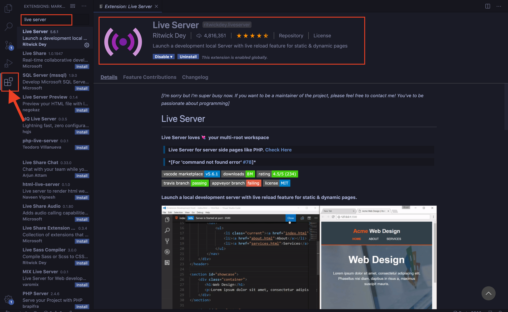

# Setup Visual Studio Code

## Download the ide [VSCODE](https://code.visualstudio.com/download)
## Install the extension Live Server by Ritwick Dey
This makes it super easy to see your application on your browser. As soon as you save your file/project in VSCode, the webpage/application get updated! No need to press refresh everytime!

 

## Create and open your project
- in a preferred location on your PC, create a folder named "Interactive_Map_With_HERE"
- In VSCODE click on File > Open.. 
- In the dialogue box, navigate to the location your created your folder "Interactive_Map_With_HERE" and open it.
- Click on File > New File and save it as 'index.html' within the folder

